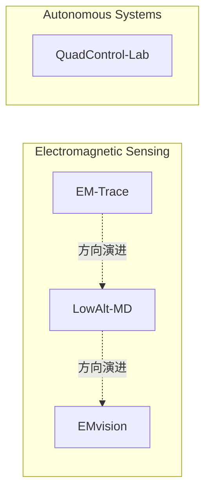

# Research Portfolio

围绕计算电磁、旋翼微多普勒分析与无人系统仿真开展的本科科研与工程实践。

- [Research Overview PDF](docs/Undergraduate_Research_Project_Overview.pdf)
- [Selected Code](selected-code/)

---

## About Me

本科阶段围绕计算电磁、旋翼微多普勒分析与无人系统仿真开展的科研与工程实践记录。

## Research Areas

- Computational Electromagnetics
- Micro-Doppler Sensing
- UAV Simulation
- Dynamics and Control

## Project Overview

| Project | Type | Focus | Capability |
| ------- | ---- | ----- | ---------- |
| [EM-Trace](projects/em-trace/) | 工程工具 | 工程链与计算电磁工具 | 参数化建模、CST 仿真与信号链分析 |
| [LowAlt-MD](projects/lowalt-md/) | 研究项目 | 低空旋翼微多普勒物理机制研究 | 物理建模、特征分析与机理解释 |
| [EMvision](projects/emvision/) | 研究项目 | 受控电磁衰减与域因素失配条件下的微多普勒识别实验设计与归因审计 | 合成实验、域因素分析与协议内归因审计 |
| [QuadControl-Lab](projects/QuadControl-Lab/) | 仿真研究 | 可审计闭环仿真中的 IDEAL / ESTIMATED 配对观测与 Layer A/B 机制检查 | 四旋翼动力学、控制链、观测边界与确定性证据审计 |

## Research Map

下图表示研究方向的演进与组织关系，不表示项目之间存在严格依赖。

## Technical Skills

| Skill | Evidence |
| ----- | -------- |
| Python | EMvision 的实验与分析流程；QuadControl-Lab 的仿真、配对实验与审计 |
| CST | EM-Trace 的参数化全波仿真与结果提取 |
| Electromagnetic Modeling | EM-Trace、LowAlt-MD 与 EMvision 的电磁建模和信号分析 |
| Micro-Doppler Analysis | LowAlt-MD 的机理分析；EMvision 的受控合成实验与协议内归因审计 |
| Control Simulation | QuadControl-Lab 的动力学与闭环控制仿真、受控观测来源比较 |
| Attitude Estimation / Observation Interface | QuadControl-Lab 的最小姿态估计、控制器观测边界与机制检查 |

## Evidence Policy

本作品集包含以下证据类型：

- 数值仿真（numerical simulation）
- 合成实验（synthetic experiments）
- 工程验证（engineering validation）

当前内容不包含真实雷达实测验证，也不包含实机飞行验证。各项目结论应在对应的模型假设、仿真条件和验证范围内理解。
