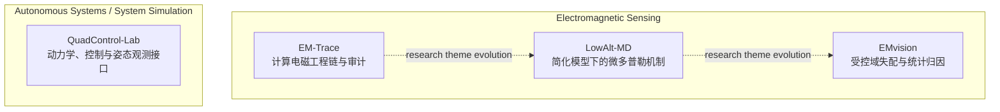

# Research Profile

_面向电子信息、电磁、雷达与无人系统方向导师的本科科研画像草案_

---

## Research Identity

本科阶段围绕计算电磁、旋翼微多普勒与无人系统仿真开展研究，形成从物理建模、数值实现到受控实验和证据审计的方法链。相比单纯完成项目，更注重坐标与相位约定、变量控制、负结果和结论边界，并具备将模型落实为可复现工程流程的能力。

## Research Map

本科阶段的研究主题由两条相关但独立的线索构成。电磁感知方向上，EM-Trace 体现计算电磁工程链与审计能力，LowAlt-MD 研究简化物理模型下的旋翼微多普勒机制，EMvision 分析受控合成协议下的域失配与统计归因；三者表示研究主题和方法关注点的演进。QuadControl-Lab 属于独立的 Autonomous Systems / System Simulation 分支，关注动力学、控制仿真与姿态观测接口。

箭头表示本科阶段研究主题与方法关注点的演进，不表示项目间的数据、代码或严格技术依赖。

- [EM-Trace](../projects/em-trace/README.md) 建立从参数化 CAD、CST 全波仿真到方向感知复场提取和 Python 信号处理的可审计工程链，体现计算电磁流程与工程审计能力。
- [LowAlt-MD](../projects/lowalt-md/README.md) 在独立的合成平坦地面模型中引入旋翼运动学、Fresnel reflection、镜像几何和相干多径，用分层模型隔离不同机制。
- [EMvision](../projects/emvision/README.md) 在独立的固定合成测试协议中，通过 C/G/P 全因子设计、配对评估和统计审计分析域失配下的协议内表现变化。
- [QuadControl-Lab](../projects/QuadControl-Lab/README.md) 作为独立的无人系统仿真分支，以模块化动力学、控制、IMU 和最小姿态估计接口构建确定性仿真验证链。

## Research Capabilities

### Physics Modeling

LowAlt-MD 是 Physics Modeling 的主要证据。项目实现 rotor kinematics、image geometry、Fresnel reflection、path phase 和 `DD/DR/RD/RR` 四路径 coherent interference，并通过 M0–M3 分层机制模型逐步增加传播复杂度。Power ledger 与 interference closure 用于检查数值实现闭合；相关结论仅支持当前简化合成模型中的机制区分，不外推为真实低空环境规律。

### Computational Electromagnetics

EM-Trace 是 Computational Electromagnetics 的主要证据。项目连接参数化 CAD、STEP 几何交接、CST full-wave simulation 与方向感知 complex-field extraction，并审计 coordinate / polarization convention、mesh sensitivity、calculation-domain consistency 和 artifact provenance。相关检查识别了未收敛结果及不可直接比较的计算域差异；现有证据支持工具链实现与工程审计，不等同于高精度 RCS 收敛或正确后向 Micro-Doppler 的定量验证。

### Experimental Design and Statistical Analysis

EMvision 展示了围绕固定合成测试域设计受控实验的能力。项目将信道匹配、生成器家族匹配和参数分布匹配组织为 C/G/P `2×2×2` 全因子协议，使用 20 个配对外层种子和 50,000 次 seed-block bootstrap，并结合六条因素加入路径、Shapley 顺序平均、条件交互、三阶交互和 negative controls 审计结果。该工作证明了构造可比较实验、分析路径依赖并识别异常角点的能力，但不把协议内统计归因解释为物理因果。

### System Simulation and Control

QuadControl-Lab 展示了模块化无人系统仿真与控制验证能力。项目建立 `Controller → Mixer → Motor → Dynamics → RK4` 主链，并通过 observation boundary 显式区分 `IDEAL_BENCHMARK` 与 `ESTIMATED` 数据来源；后者仅提供姿态和角速度有效字段。确定性姿态阶跃、力矩扰动及自动化验证用于检查控制和观测接口，但当前范围不包括实机飞行、HIL、完整位置速度估计或真实传感器闭环。

## Representative Research Achievements

- **EM-Trace**：面向旋翼目标，贯通参数化 CAD、CST 全波仿真、方向感知复场提取和 Python 信号处理，并以方向、极化、网格及计算域审计建立可追溯证据链。
- **LowAlt-MD**：面向合成低空旋翼传播，构建 M0–M3 分层多径模型和复回波分析流程，区分公共增益、散射单元相关权重与相干四路径干涉。
- **EMvision**：面向固定测试域上的旋翼微多普勒域失配，设计 C/G/P 全因子配对协议和统计审计流程，量化路径依赖、交互及异常角点。
- **QuadControl-Lab**：面向四旋翼系统仿真，集成刚体动力学、执行器、控制器、IMU 与最小姿态估计接口，并通过确定性场景验证控制与观测链路。

## Potential Graduate Research Direction

### Radar Scattering and Micro-Doppler Sensing

- 继续研究雷达目标散射建模，以及复杂旋翼几何、方向、极化和复场数据之间的关系。
- 围绕旋翼运动、传播环境和观测条件对时频结构的影响，开展模型驱动的微多普勒感知研究。
- 进一步分析电磁环境中的地面多径、路径相位和相干叠加，并探索更完整的地形、粗糙面或目标背景模型。

### Autonomous Systems Modeling, Sensing and Control

- 延伸现有四旋翼刚体动力学、执行器和控制仿真基础，研究更完整的无人系统建模与验证问题。
- 探索感知结果、观测有效性与控制器输入之间的接口，但不将其表述为当前已经完成的感知—控制闭环能力。
- 在后续研究条件具备时，将真实数据、硬件或 HIL 验证纳入研究流程，用于检验仿真假设与接口设计。

第二组内容属于未来研究兴趣；当前项目证据主要支持动力学、控制仿真和姿态观测接口。以上方向均不构成对后续成果、性能或应用效果的预测。

## Evidence Boundary

**已完成的工作：**

- 完成 EM-Trace 的参数化几何交接、CST 复场处理流程实现与工程审计，并完成方向/极化约定修正及 mesh / calculation-domain 审计；这些工作不等于高精度 RCS 收敛验证，也不等于正确后向 Micro-Doppler 的定量验证。
- 完成 LowAlt-MD Synthetic Physics Model v2、M0–M3 分层机制实验、功率与干涉闭合检查及 matched-budget negative result 整理。
- 完成 EMvision 冻结的 C/G/P 全因子研究、配对 bootstrap、路径与交互分析、negative controls 和 `v011` seed-level audit。
- 完成 QuadControl-Lab 模块化仿真架构、有限确定性控制场景、最小姿态估计接口及自动化工程验证。

**尚未完成或未被现有证据支持的工作：**

- 无真实雷达回波、外场测试、真实等离子体传播或真实低空环境验证。
- 不声称高精度 absolute RCS 收敛、正确后向 Micro-Doppler 的定量验证或 full-wave target-background simulation。
- 不将合成协议中的分类表现、Shapley 汇总或交互量外推为真实系统泛化能力或物理因果关系。
- 无实机飞行、HIL、完整位置速度估计、EKF 或真实传感器闭环验证。

因此，这份科研画像所体现的主要是本科阶段形成的建模、计算、实验设计、工程审计和证据边界意识，而不是已经完成真实雷达或实机闭环验证，也不代表已经获得普适科研结论。
