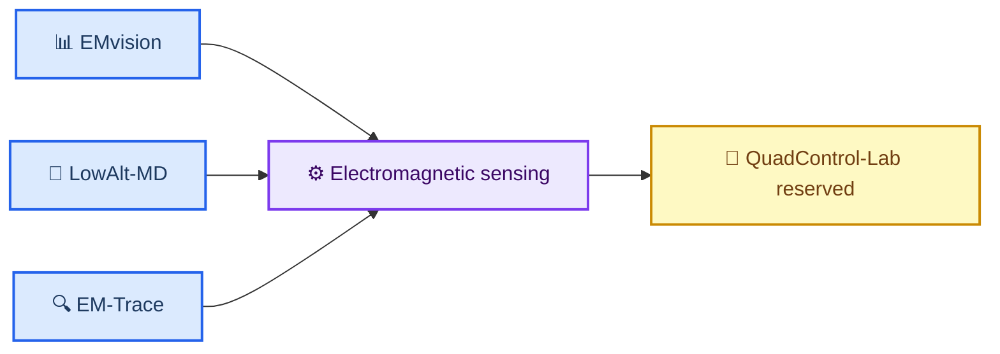

# Research overview

_三个本科科研项目的方向、关系与技术路线模板。_

---

## 🎯 个人研究方向

当前作品集围绕以下方向组织：

- Computational Electromagnetics
- UAV Sensing
- Micro-Doppler Analysis
- Simulation and Control

个人经历、研究兴趣的优先级和教育背景细节待补充；本页不预设未被项目材料支持的个人信息。

## 🔗 三个项目关系

三个已完成展示版项目从不同层面连接到同一条科研能力主线：

- **EMvision**：关注电磁仿真、旋翼微多普勒和识别证据的组织方式
- **LowAlt-MD**：关注低空多径路径相位、相干干涉、特征域偏移与泛化边界
- **EM-Trace**：关注从参数化 CAD、CST 全波求解到复场处理和 STFT 的可追溯工程链

下面的关系图用于展示作品集的组织逻辑，不表示三个项目共享同一数据集、代码库或实验结果。

## 🛠️ 总技术路线

当前展示版可按以下顺序阅读：

1. 从参数化几何、传播路径或合成场景定义问题
2. 通过电磁仿真或物理代理生成可分析的复场、回波或微多普勒信号
3. 使用特征、频谱、相干功率账本或 STFT 表达结构变化
4. 通过负对照、敏感性、域迁移或证据矩阵检查解释边界
5. 以项目摘要、图件和 Original Repository 入口向外展示

这是一条作品集层面的阅读路线，不替代任一原项目的完整复现流程。

## 📌 待补充信息

- 个人简介与教育背景
- 各项目的公开 Original Repository 链接
- 作品集总关系图的最终视觉版本
- 后续研究方向与合作切入点
