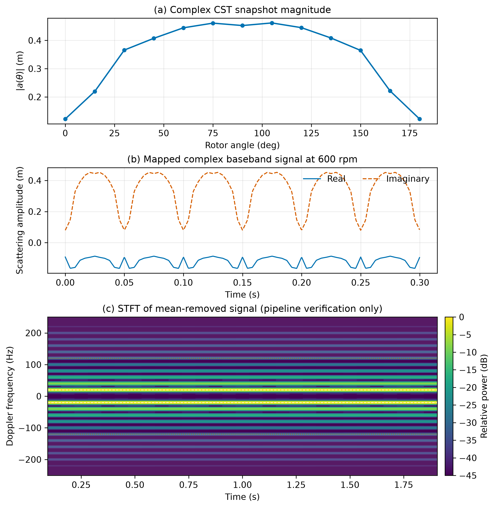

# EM-Trace key results

_Selected audit results retained from the frozen project summary._

---

## 📊 M1 mesh-sensitivity audit

M1 covers a single-rotor frozen pose pair `P0` and `P180`, not a full-quadrotor mesh-convergence proof.

| Pose | L13 RCS (dBsm) | L16 RCS (dBsm) | L13→L16 change | Stability |
| --- | ---: | ---: | ---: | --- |
| P0 | −37.438571 | −37.107342 | 0.331229 dB | Not at threshold |
| P180 | −37.502275 | −37.450931 | 0.051345 dB | Not at threshold |

The accurate display statement is: solver execution succeeded and mesh sensitivity was audited, but single-pose numerical convergence was not established.

## 📐 A3 calculation-domain control

Keeping geometry, material, excitation, solver and observation direction fixed while comparing calculation domains produced the following changes:

| Control | Complex-field change | RCS change | Decision |
| --- | ---: | ---: | --- |
| Body-only automatic domain → unified full domain | 85.807734% | 16.809791 dB | FAIL |
| Body+arms automatic domain → unified full domain | 33.134155% | 1.371822 dB | FAIL |

These results show that the actual calculation box materially changes the overall response. They cannot be attributed to boundary reflection alone or conflated with mesh effects.

## 🔄 Stage 7 process evidence

The angle-snapshot pipeline demonstrates data structure, complex-number handling, time mapping and STFT software flow. A displayed 20 Hz component is consistent with the preset 180° periodic mapping at 600 rpm and two blades; it is not an independent blade-frequency validation or a quantitative spectral-amplitude claim.

## 🖼️ Supporting figures

_Figure 3: Static angle snapshots mapped into slow time and STFT._
