# EM-Trace methodology

_Display-level engineering workflow for EM-Trace._

---

## ⚙️ Traceable workflow

```mermaid
flowchart LR
    accTitle: EM-Trace engineering workflow
    accDescr: The workflow links parameterized CAD, STEP exchange, CST frequency-domain solving, complex far-field extraction, numerical audits and evidence-bounded reporting.

    parametric_cad[📋 Parametric CAD] --> step_exchange[📦 STEP AP214 exchange]
    step_exchange --> cst_solve[⚙️ CST frequency-domain solve]
    cst_solve --> far_field[📊 Complex far-field extraction]
    far_field --> numerical_audit[🔍 Direction, mesh and domain audit]
    numerical_audit --> evidence_class{🏷️ Evidence class?}
    evidence_class -->|Method| engineering_capability[✅ Engineering capability]
    evidence_class -->|Limited numeric| engineering_baseline[⚠️ Engineering baseline]
    evidence_class -->|Legacy input| process_demo[🔄 Process demonstration]
    engineering_capability --> mentor_report[📝 Mentor-facing report]
    engineering_baseline --> mentor_report
    process_demo --> mentor_report

    classDef process fill:#dbeafe,stroke:#2563eb,stroke-width:2px,color:#1e3a5f
    classDef decision fill:#fef9c3,stroke:#ca8a04,stroke-width:2px,color:#713f12
    classDef success fill:#dcfce7,stroke:#16a34a,stroke-width:2px,color:#14532d
    classDef warning fill:#ffedd5,stroke:#ea580c,stroke-width:2px,color:#7c2d12

    class parametric_cad,step_exchange,cst_solve,far_field,numerical_audit process
    class evidence_class decision
    class engineering_capability,mentor_report success
    class engineering_baseline,process_demo warning
```

## 📐 Frozen setup

The display summary records Vacuum/PEC, 10 GHz, HH polarization, `PlaneWave.Normal = (+1, 0, 0)`, single-station backscatter at `θ = 90°`, `φ = 180°`, CST local `E_phi` extraction and the global receiver basis `E_global_y = -E_phi`.

## 🔍 Signal-processing stage

Static angle snapshots are mapped to slow time and then processed with Python STFT. The current process display uses the evidence class of the input data explicitly; it is not presented as a corrected, quantitatively validated backscatter micro-Doppler result.
