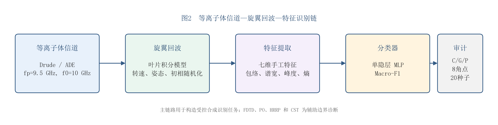

# EMvision

_二维电磁仿真、旋翼微多普勒与三维 PO 角序列的展示版项目。_

---

## 📋 Project snapshot

- **Focus:** synthetic electromagnetic simulation, rotor micro-Doppler and feature-identification evidence
- **Current scope:** hypothesis-driven synthetic research and reproducible numerical analysis
- **Evidence boundary:** no measured identification validation is claimed in this portfolio
- **Source entry:** **Original Repository** — link to be added after the source repository is made public

## 📚 Portfolio contents

- [Summary](summary.md)
- [Methodology](methodology.md)
- [Key results](key_results.md)
- [Contribution](contribution.md)

## 🖼️ Selected figures

_Figure 1: Research question and C-G-P full-factorial protocol._

_Figure 2: Channel, echo and feature-identification chain._

## ⚠️ Display boundary

This folder contains a small selection of display materials only. It does not copy source code, raw data, temporary files, cache, intermediate results or the full paper package.
