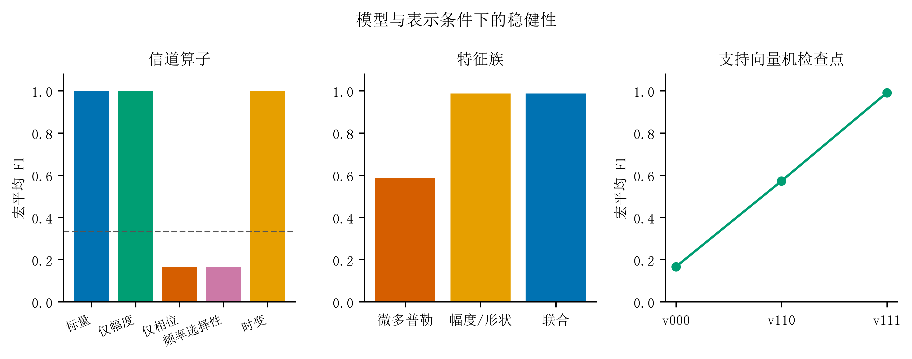

# EMvision key results

_Selected results retained from the current mentor-facing display materials._

---

## 📊 Reported evidence

- The pure-noise negative control is reported as `32.4 ± 2.2%`.
- At `fp = 9.5 GHz`, the independent-test condition retraining and fixed-model figures are reported as `95.1 ± 1.8%` and `36.8 ± 9.1%`, respectively.
- The current main narrative places the `2 × 2 × 2` channel–generator–parameter attribution and interaction audit at the center of the project evidence.
- A fixed-budget resource-allocation diagnostic and a third-generator stress test are retained as supplementary evidence within the synthetic protocol.
- The current display materials report `92/92` tests passed for the unified test set.

## 🧭 What the numbers do not mean

The results above are synthetic-protocol results. They should not be presented as measured radar accuracy, independent full-wave validation or proof that a high within-condition score transfers across operating conditions.

## 🖼️ Supporting figures

_Figure 3: Six-path and condition-interaction display figure._

_Figure 4: Robustness and supplementary diagnostic evidence._

## 🚫 Retracted display claims

The current source materials explicitly withdraw the earlier CST single-station external-validation claim and unconverged deep-null or small-net-difference conclusions. They are not carried into this portfolio.
