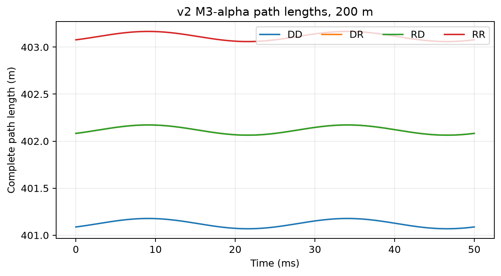
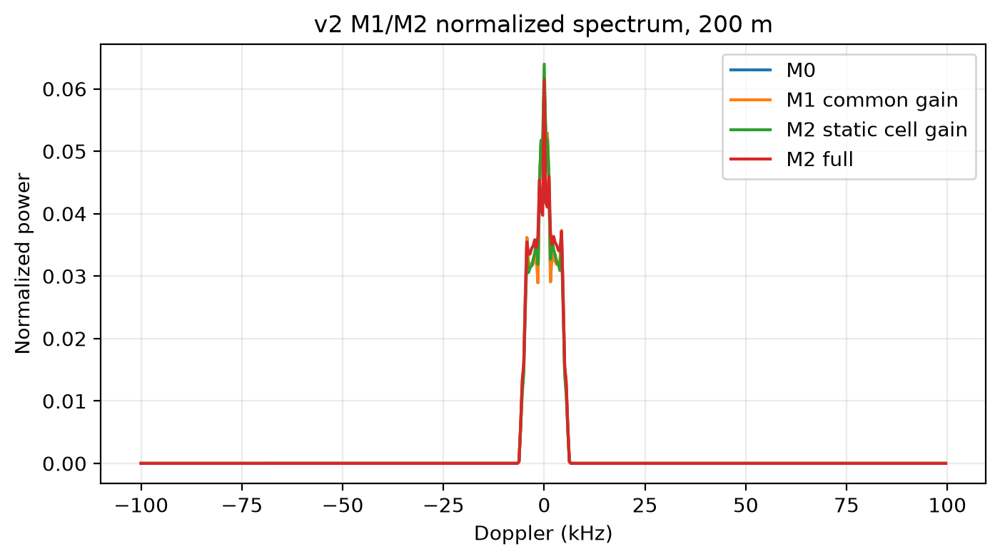

# LowAlt-MD

_低空地面多径作用下旋翼微多普勒特征演化与识别边界的展示版项目。_

---

## 📋 Project snapshot

- **Focus:** path-phase mechanisms, coherent interference and controlled cross-environment recognition
- **Model scope:** Physics Model v2, flat lossy ground, low-order specular multipath and isotropic point-scatterer proxy
- **Current status:** synthetic evidence chain frozen for mentor-facing display
- **Source entry:** **Original Repository** — link to be added after the source repository is made public

## 📚 Portfolio contents

- [Summary](summary.md)
- [Physics framework](physics_framework.md)
- [Validation framework](validation_framework.md)
- [Contribution](contribution.md)

## 🖼️ Selected figures

_Figure 1: DD/DR/RD/RR path-length display for the 200 m case._

_Figure 2: Common-gain baseline versus element-wise proxy spectrum._

## ⚠️ Display boundary

This folder does not copy raw results, large feature matrices, binary caches, experimental scripts or temporary files. Current scientific numbers remain governed by the Physics Model v2 source materials.
