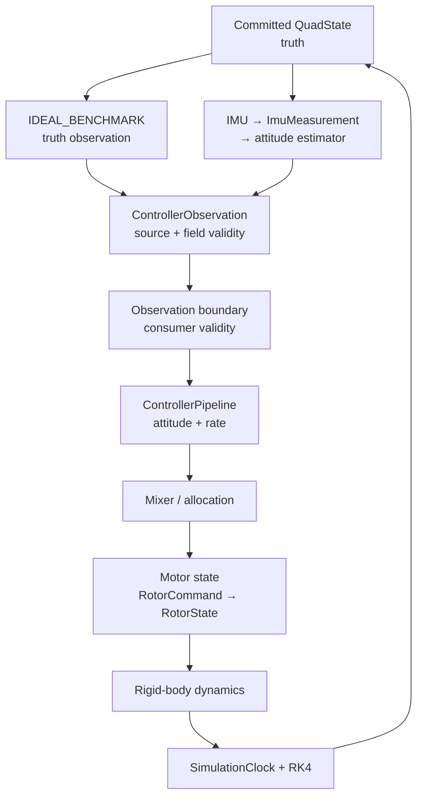

# QuadControl-Lab

*模块化四旋翼飞控仿真与姿态估计验证平台。*

---

## 📋 Overview

QuadControl-Lab is a modular quadrotor flight-control simulation project focused on:

- rigid-body dynamics and actuator modeling;
- attitude/rate flight-control architecture;
- IMU measurement and minimal attitude estimation;
- deterministic, auditable experiment validation.

The project is an undergraduate self-developed research platform. It is not presented as a complete autonomous aircraft or a production flight stack.

## 🏗️ System architecture

*Figure 1: Two explicit observation paths feed the same attitude/rate control and plant architecture. The `ESTIMATED` path is attitude-only.*

The two paths are deliberately distinct:

- `IDEAL_BENCHMARK`: committed truth → full observation → controller-facing adapter.
- `ESTIMATED`: `IdealImu` → `ImuMeasurement` → `MinimalAttitudeEstimator` → partial observation → `ATTITUDE_INNER_LOOP` adapter.

The formal V1 plant artifacts use `IDEAL_BENCHMARK`. The `ESTIMATED` path has standalone observation and attitude-inner-loop assembly evidence; it does not claim full-state estimated flight performance.

## 🧱 What I built

- **Rigid-body dynamics** — translational/rotational equations, quaternion state representation, frame-aware force and torque aggregation.
- **Controller pipeline** — fixed attitude → angular-rate call boundary with explicit reference, thrust, timing, and allocation-feedback contracts.
- **Mixer and allocation** — wrench-to-rotor command mapping, feasibility reporting, and explicit allocation-failure provenance.
- **Rotor/motor model** — generic N-rotor interfaces, exact quasi-static path, and first-order rotor-state dynamics.
- **Formal simulation chain** — `SimulationClock`, independent fixed-step RK4, state-aware scheduler, and actuator-to-state plant assembly.
- **Sensing, estimation, and validation** — IMU specific-force model, `MinimalAttitudeEstimator`, observation contracts, and deterministic experiment artifacts.

## 🧭 Engineering design

- `verification != simulation`: the formal integrator is independent of verification-only numerical paths.
- Layered dependencies prevent controllers from importing simulation and prevent estimators from accessing truth or controller internals.
- Physics, observation, control, and actuator updates have explicit multi-rate boundaries; RK4 stages use held plant input.
- `ControllerObservation` separates source provenance, aggregate validity, and consumer-specific field validity.
- Deterministic seeds, simulated time, parameter hashes, Git commits, full-rate logs, and JSON provenance support replay.
- Allocation failure, controller saturation, motor-state limiting, and physical limitation remain separate event categories.

## 🧪 Validation

Existing source evidence is summarized in [`evidence/validation_summary.md`](evidence/validation_summary.md).

| Scenario | Evidence-backed result | Meaning |
| --- | --- | --- |
| Hover baseline | 10 s / 10,000 physics steps; final altitude ≈ 1.0 m; allocation failure 0; motor limiting 0 | Formal benchmark chain and artifact logging |
| Attitude step | +10° roll; peak geodesic error 9.9998°; final error 0.004746°; settling-like time 1.383 s | Attitude/rate response; not position hold |
| Initial perturbation | +2° initial roll; final error 0.00095°; settling-like time 0.665 s | Finite deterministic initial-condition response |
| Torque disturbance | 0.05 N·m, 0.1 s Body FLU roll/pitch pulse; max error 1.603°; recovery time 0.69 s | Finite deterministic disturbance response |
| ESTIMATED inner loop | `ESTIMATED` source; attitude/angular velocity valid; position/velocity invalid; deterministic adapter/controller-boundary tests | Observation path validation, not full estimated flight |

All numeric claims above come from the existing source repository artifacts. No new experiment was run for this profile page.

## ✅ Automated verification

The source repository's final verification recorded **1129 tests passed**. `ruff check .` and `mypy core controllers tests simulation estimation experiments` also passed. Test count is an engineering guardrail, not the project's scientific contribution.

## ⚠️ Limitations

- No EKF or full position/velocity estimator.
- No GPS, magnetometer, barometer, or sensor fusion.
- No position hold or altitude hold from estimated position/velocity.
- No HIL, real vehicle, or real-flight validation.
- The current `ESTIMATED` path is limited to attitude/rate inner-loop consumption.
- Finite-scenario results do not prove global stability, robustness, convergence, or flight safety.

## 🔗 Original repository and evidence

- [Original QuadControl-Lab source repository](https://github.com/feiranzhao15077/QuadControl-Lab)
- [Final architecture source](https://github.com/feiranzhao15077/QuadControl-Lab/blob/main/docs/project/quadcontrol_architecture.md)
- [Validation summary source](https://github.com/feiranzhao15077/QuadControl-Lab/blob/main/docs/project/validation_summary.md)
- [Source Phase 6 status index](https://github.com/feiranzhao15077/QuadControl-Lab/blob/main/docs/simulation/phase6_status.md)
