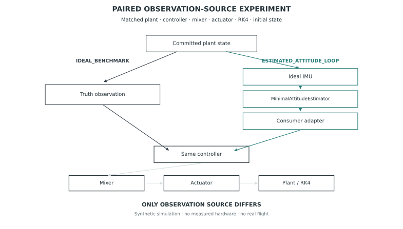
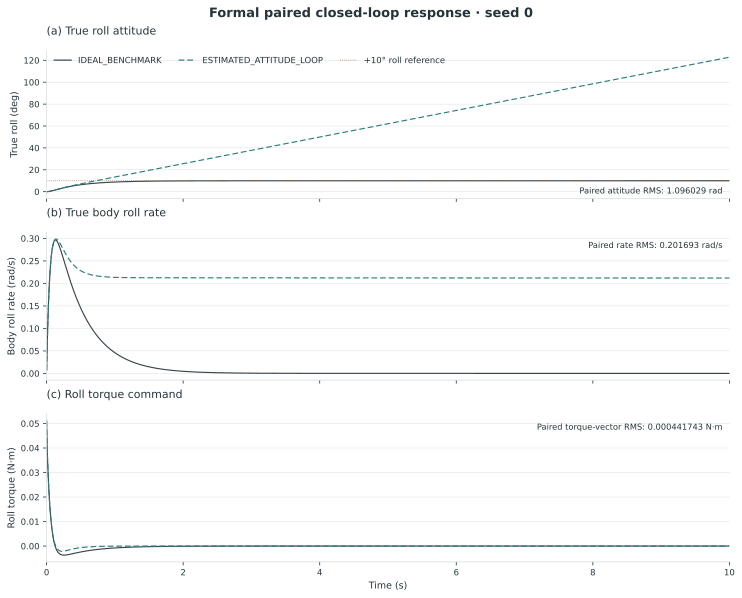
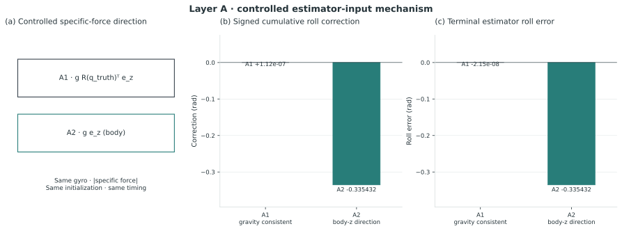
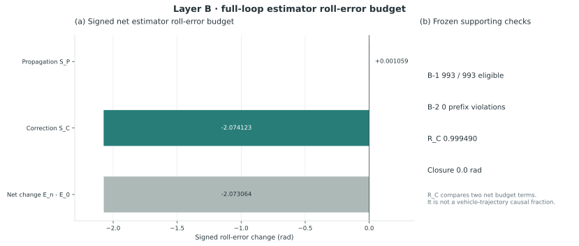

# QuadControl-Lab

面向观测来源与估计假设影响分析的可审计四旋翼闭环仿真平台。

## Project Overview

| Field | Content |
| --- | --- |
| Project Type | Auditable Quadrotor Simulation / Controlled Mechanism Study |
| Status | Completed showcase / final synthetic result frozen |
| Role | Dynamics and control simulation, observation-interface design, paired-experiment implementation, mechanism audit and provenance |
| Keywords | Quadrotor Dynamics, RK4, Observation Contract, Paired Evaluation, Attitude Estimation, Deterministic Validation |

本项目研究：当 plant、controller、mixer、actuator、scheduler 和实验条件保持一致、仅改变控制器消费的 observation source 时，闭环姿态行为如何变化？在所用最小姿态估计器中，specific-force gravity-direction assumption 又如何与估计 roll 的变化相联系？这是受控合成仿真与机制审计，不是新控制算法或实机飞控验证。

## Research Question

用同一套闭环仿真链比较 `IDEAL_BENCHMARK` 与 `ESTIMATED_ATTITUDE_LOOP`，再以 Layer A 的受控估计器输入和 Layer B 的全环回放诊断，检查观测来源变化与估计假设相关的证据边界。配对实验测得的真实轨迹差异，不能直接归因于估计器中的某个单独环节。

## Auditable Simulation Platform

平台使用 13D numerical state、ENU / FLU 坐标约定、Hamilton `q_wb`、Newton–Euler 刚体模型与固定步长 RK4。Controller → Mixer → Motor → Dynamics 的链路接入 `SensorContext`、`IdealImu`、`MinimalAttitudeEstimator` 和 typed observation contract；确定性 scheduler、字段有效性检查及 provenance 记录让实验条件和消费的观测来源可核查。

## Paired Observation Experiment

*Figure 1 · 冻结配对协议的概念结构图。两臂共享 plant、controller、mixer、actuator、RK4、reference 与初始化；`IDEAL_BENCHMARK` 消费 truth observation，`ESTIMATED_ATTITUDE_LOOP` 消费由 Ideal IMU、最小姿态估计器和 consumer adapter 生成的观测。它不是完整飞行系统图或性能结果。*

## Closed-Loop Result

*Figure 2 · 固定 +10° roll `ATTITUDE_STEP`、seed 0、10 s 的冻结配对响应；展示真实状态和控制命令的分离，不比较不同控制算法，也不证明稳定性。*

预先定义的配对指标中，真实姿态轨迹的 RMS 角距离为 **1.096029 rad**，真实角速度的 RMS 配对差为 **0.201693 rad/s**。同侧 observation-to-truth 姿态 RMS：`IDEAL_BENCHMARK` 为 **0 rad**，`ESTIMATED_ATTITUDE_LOOP` 为 **1.184857 rad**。这些值来自同一固定合成场景的冻结产物，不是跟踪性能、估计器普适精度或飞行性能指标。

[Figure 3：观测、命令与真实状态差异的时间线](assets/figure_03_divergence_timeline.svg)仅作描述性上下文，不给出因果时滞或单一机制归因。

## Controlled Mechanism — Layer A

*Figure 4 · 两个受控估计器输入案例保持 gyro、specific-force 模长、时间戳及初始化相同，只改变 specific-force 方向；并非完整 plant 的反事实实验。*

冻结判定为 **SUPPORTED**。A1/A2 终端姿态误差分别为 **0 rad** 与 **0.3354319429327265 rad**；两臂公式检查各 **200/200 PASS**。该结果支持所限定输入条件下的方向敏感机制，不外推真实传感器或所有飞行状态。

## Full-Loop Mechanism — Layer B

*Figure 5 · 冻结全环回放中的估计器 roll-error 净累计预算及 B-1/B-2/B-3 检查；图中比例不是车辆轨迹差异的因果份额。*

Layer B 冻结判定为 **SUPPORTED**：parent replay 比较 **10,000 rows / 328,049 recursive fields / 0 mismatches**；B-1 为 **993/993**，B-2 为 **0 prefix violations**，B-3 的预算闭合残差为 **0 rad**。`S_P=+0.0010590188090782893 rad`、`S_C=-2.074123335176487 rad`，对应 `R_C=0.9994896743377543`。

**`R_C` 仅是估计器 roll-error 两项有符号净累计预算的相对量，不是车辆轨迹差异的因果百分比。** 结果不表明“关闭 correction 就会恢复 IDEAL 轨迹”。

## Evidence Chain

闭环配对现象 → 受控输入机制（Layer A）→ 全环回放与机制一致性检查（Layer B）→ 冻结结论边界。数值含义以[公开证据索引](evidence/validation_summary.md)及源项目的 final result freeze 为准；这里不把诊断性时间线升级为新的正式指标。

## Reproducibility / Auditability

固定协议记录初始条件、观测来源和运行身份；Layer B 对 parent 进行逐字段精确回放比较。正式指标、Layer A/B 判定与图 1–5 均有冻结产物 SHA-256 和图像 provenance。作品集只发布精选图与代码选读，不包含原始大体积 JSON、完整依赖或独立复现包。

## My Contribution

- 建立四旋翼动力学、控制分配、执行器、数值积分与传感器的模块化仿真链。
- 设计显式 observation contract 和 `IDEAL_BENCHMARK` / `ESTIMATED_ATTITUDE_LOOP` 配对边界。
- 实现确定性配对配置、受控 Layer A 输入、Layer B 回放等价检查与估计器误差预算审计。
- 整理冻结结果、图像来源和不可外推的结论边界。

## Limitations

- **Synthetic simulation only**；正式配对实验仅为固定 +10° roll `ATTITUDE_STEP`、seed 0、10 s、无传感器噪声/偏置及外部扰动的条件。
- Layer A 是估计器输入层面的受控比较；Layer B 是该全环协议下的机制一致性诊断。二者不构成车辆轨迹差异的完整因果分解。
- 仅采用 `IdealImu` 与 `MinimalAttitudeEstimator`；没有 EKF、完整位置/速度估计或跨算法 estimator benchmark。
- 无硬件、HIL 或实机飞行验证；没有全局稳定性证明、飞行安全结论或对现实噪声/偏置的泛化保证。

## Repository / Evidence

- **Selected Code**：[QuadControl-Lab selected implementation](../../selected-code/quadcontrol-lab/)；供源码审阅，不是完整复现包。
- **Public Evidence**：[Frozen-result and figure index](evidence/validation_summary.md)。
- **Original Repository**：[QuadControl-Lab source](https://github.com/feiranzhao15077/QuadControl-Lab)（访问权限以源仓库设置为准）。
- **Final Freeze / Captions / Provenance**：[结果冻结](https://github.com/feiranzhao15077/QuadControl-Lab/blob/123ab8a57f355e7c615a9c841fcd94b84b5ddd91/docs/experiments/phase3_7_10_final_result_freeze.md) · [图注](https://github.com/feiranzhao15077/QuadControl-Lab/blob/123ab8a57f355e7c615a9c841fcd94b84b5ddd91/docs/figures/final/figure_captions.md) · [图像来源](https://github.com/feiranzhao15077/QuadControl-Lab/blob/123ab8a57f355e7c615a9c841fcd94b84b5ddd91/docs/figures/final/figure_provenance.md)（源仓库若未公开，这些链接可能需授权）。
