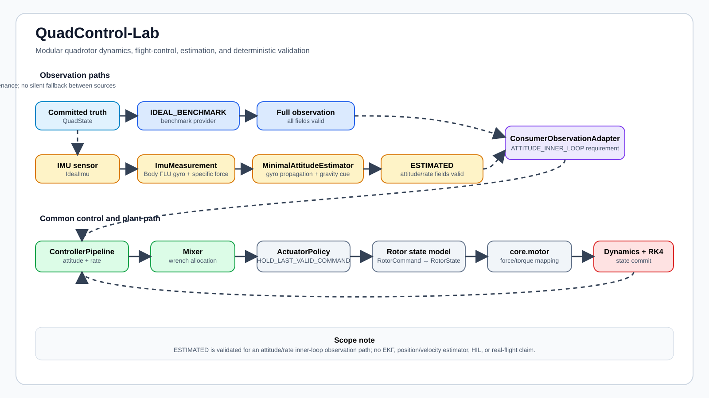
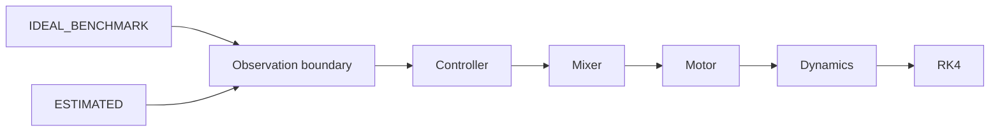
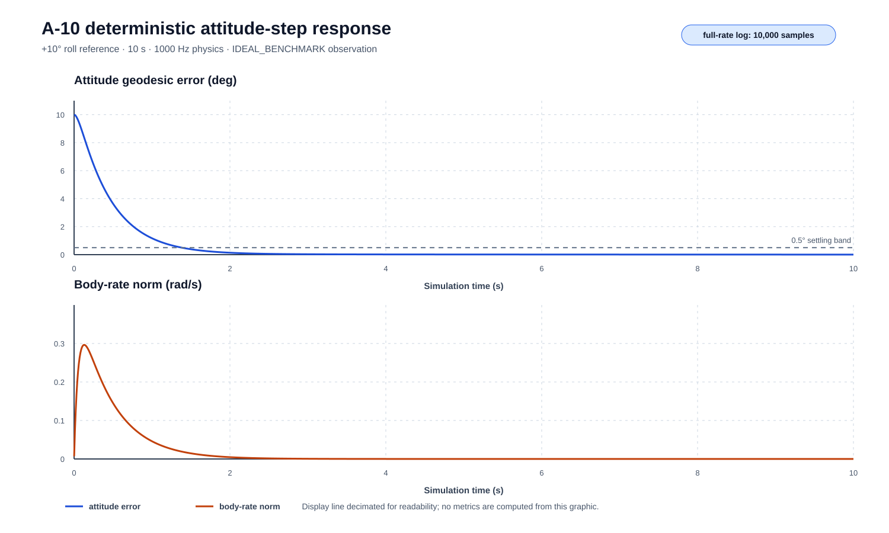

# QuadControl-Lab

模块化四旋翼动力学、控制与最小姿态估计接口验证平台。

---

## Project Overview

| Field | Content |
| ----- | ------- |
| Project Type | Engineering Simulation Platform |
| Status | Completed showcase / validation platform |
| Role | 仿真架构、动力学与控制链路、最小姿态估计接口及验证流程开发 |
| Keywords | Quadrotor Dynamics, Flight Control, IMU, Attitude Estimation, RK4, Validation |

本项目用于建立一套模块边界清晰、可替换且可审计的四旋翼仿真平台，以便分别检查动力学、执行器、控制器、传感器和观测接口。工程上重点解决不同模块之间的状态与坐标约定、控制分配、执行器状态更新、观测来源和验证证据难以追踪的问题。

当前验证范围限定为确定性数值仿真、有限场景闭环响应、最小姿态估计接口和自动化工程验证。项目不代表完整自主飞行器、生产级飞控系统或真实飞行验证。

## Problem and Motivation

- 模块化仿真架构用于分离物理模型、控制逻辑、执行器和数值积分器，使各模块能够独立检查和替换，并减少耦合实现对问题定位的干扰。
- `observation boundary` 用于显式区分 `IDEAL_BENCHMARK` 与 `ESTIMATED` 数据来源，同时记录字段有效性和 consumer contract，避免控制器无意使用不可用状态或隐式 truth fallback。
- `deterministic validation` 用于固定随机种子、仿真时间、参数身份和输出证据，使有限场景可以复现，并将控制饱和、分配失败、电机限幅和物理限制分别记录。

这些设计服务于仿真平台的工程验证，不构成 HIL、实机飞行性能或飞行安全证明。

## Architecture / Method

*项目整体架构图：两条显式 observation path 接入同一控制与动力学链；`ESTIMATED` 仅用于姿态/角速度内环接口验证。*

`IDEAL_BENCHMARK` 使用已提交的 truth state 构造完整观测；`ESTIMATED` 采用 `IdealImu → ImuMeasurement → MinimalAttitudeEstimator → ControllerObservation` 路径，仅提供姿态/角速度有效字段。两条路径均通过 observation boundary 后进入 `Controller → Mixer → Motor → Dynamics → RK4` 主链。

## My Contribution

- **仿真架构设计**：建立分层依赖、`SimulationClock`、固定步长 RK4、状态感知调度和多速率更新边界。
- **动力学、执行器和传感器接口实现**：实现刚体平动/转动方程、四元数状态、坐标系感知的力与力矩聚合、Mixer、转子/电机状态模型和 IMU specific-force 模型。
- **IMU 与最小姿态估计接口**：实现 `IdealImu`、`ImuMeasurement` 和 `MinimalAttitudeEstimator` 到姿态内环的受限观测路径。
- **Observation contract 与 provenance 设计**：记录观测来源、聚合有效性、consumer-specific 字段有效性、分配失败和执行器限制来源。
- **确定性实验与自动化验证**：组织有限场景实验、参数哈希、Git commit、全速率日志和 JSON provenance；原仓库最终验证记录为 1129 tests passed，并通过 `ruff` 与 `mypy` 检查。

上述贡献构成仿真与验证平台，不表示完成了完整飞控系统或真实飞行闭环。

## Representative Results

| Result | Evidence-backed observation | Boundary |
| ------ | --------------------------- | -------- |
| 10° roll attitude step | 最终姿态误差约 `0.004746°`，settling-like time 为 `1.383 s` | `IDEAL_BENCHMARK` 下的 deterministic simulation；不代表真实飞行性能或位置保持能力 |
| 0.05 N·m body torque pulse | 最大姿态误差约 `1.603°`，恢复时间约 `0.69 s` | `IDEAL_BENCHMARK` 下的有限确定性扰动场景；不证明全局鲁棒性或飞行安全 |
| ESTIMATED observation path | 完成姿态和角速度有效观测、字段有效性及控制器边界验证；位置和速度字段无效 | `ESTIMATED` 接口级 deterministic validation；不是完整 estimated-flight 或真实传感器闭环结果 |

所有数值均来自原仓库已有实验产物，本展示页未重新运行实验。

## Figures / Evidence

1. [Project architecture](assets/quadcontrol_architecture.svg)：项目整体架构图，展示 observation path、控制链和动力学主链。
2. [Attitude step response](assets/attitude_step_response.svg)：确定性姿态阶跃响应示例；图中曲线用于展示，指标来自原始 full-rate artifact。

*确定性姿态阶跃响应示例；该结果使用 `IDEAL_BENCHMARK`，不代表真实飞行性能。*

## Limitations

- 无实机飞行验证，也不声称真实飞行性能或飞行安全。
- 无 HIL 验证。
- 无完整位置/速度估计，不支持基于估计位置或速度的位置保持和高度保持。
- 无 EKF，也未集成 GPS、磁力计、气压计或完整 sensor fusion。
- 无真实传感器闭环；当前 IMU 与 `ESTIMATED` 路径属于确定性仿真和接口验证。
- 当前 `ESTIMATED` 路径仅用于姿态/角速度内环消费，不构成持久化的 full-plant estimated-flight 结果。
- 有限场景结果不证明全局稳定性、鲁棒性、收敛性或对未测试工况的泛化能力。

## Repository / Evidence

- **Original Repository**：[QuadControl-Lab source repository](https://github.com/feiranzhao15077/QuadControl-Lab)
- **Evidence**：[Portfolio evidence index](evidence/validation_summary.md)；[Source Phase 6 status index](https://github.com/feiranzhao15077/QuadControl-Lab/blob/main/docs/simulation/phase6_status.md)
- **Validation Summary**：[Validation summary source](https://github.com/feiranzhao15077/QuadControl-Lab/blob/main/docs/project/validation_summary.md)
- **Architecture Source**：[Final architecture source](https://github.com/feiranzhao15077/QuadControl-Lab/blob/main/docs/project/quadcontrol_architecture.md)
