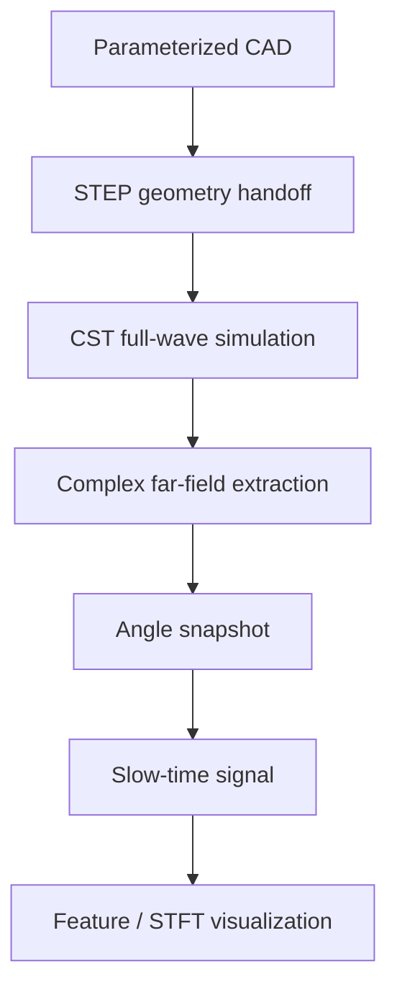
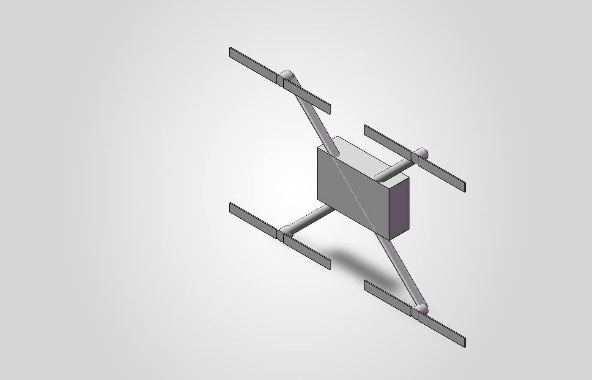

# EM-Trace

面向旋翼目标的可审计计算电磁工具链，贯通参数化 CAD、CST 全波仿真、方向感知复场提取与 Python 信号处理流程。

---

## Project Overview

| Field | Content |
| ----- | ------- |
| Project Type | Computational Electromagnetics Engineering Toolchain |
| Status | Completed showcase / audited engineering workflow |
| Role | 参数化 CAD、CST 仿真、复场提取、Python 信号链与工程审计流程开发 |
| Keywords | Parameterized CAD, CST, Full-Wave Simulation, Complex Field Extraction, Signal Processing, Reproducibility |

旋翼目标的运动相关特征不能由单一 RCS 数值或一张结果截图完整表达。为了让电磁仿真结果能够进入下游信号生成与特征分析，工具链需要持续保留几何状态、入射与观测方向、复幅度与相位、极化约定、求解器 metadata 和处理参数。

EM-Trace 将仿真输出视为可追溯的数据产品，而不是孤立的数值或图像。当前验证范围覆盖参数化几何交接、CST full-wave workflow、方向感知复场提取、angle snapshot 到 slow-time signal 的处理实现，以及 mesh、calculation domain 和 provenance 审计；不包含真实雷达测试或定量 Micro-Doppler 验证。

## Problem and Motivation

当目标是研究旋翼运动相关信号时，几何模型、坐标系、入射方向、观测方向、复场相位和极化基必须在 CAD、CST、结果导出和 Python 处理之间保持一致。任何一个环节的语义错误，都可能产生外观合理但物理含义错误的曲线。

单一 RCS 或求解器截图不能说明复场提取方向是否正确、不同结构模型是否使用一致的 calculation domain，也不能记录下游时间序列如何生成。因此，本项目建立可追溯工程链，将 geometry handoff、solver metadata、complex field、signal processing、artifact mapping 和 Git provenance 放在同一验证框架中。

该工具链用于仿真与工程审计，不解决真实雷达识别问题，也不把流程贯通等同于物理模型或数值结果的完整验证。

## Architecture / Method

方向和极化约定是数据链的一部分。保存的平面波沿 `+X` 传播，因此 `φ=0°` 是 forward direction，单站后向观测固定为 `θ=90°, φ=180°`；在当前极化基下，global Cartesian 分量满足 `E_global_y = -E_phi`。历史上错误标记为 backscatter 的 `φ=0°` 文件被保留为审计记录，但不再作为后向结果使用。

工程审计还区分 solver completion 与 numerical convergence。L7→L10→L13→L16 adaptive-pass 记录没有证明单姿态数值稳定；不同结构模型的自动 calculation domain 也不能直接用于精确结构贡献比较。完整的正确后向 Micro-Doppler 链未被证明稳定可用，因此当前信号链限定为 angle-snapshot-driven workflow demonstration。

## My Contribution

- **参数化 CAD 与几何交接流程**：建立 SolidWorks 四旋翼装配体，并组织受控的 STEP-to-CST geometry handoff。
- **CST 仿真流程和结果管理**：配置 frequency-domain full-wave workflow、adaptive-pass bookkeeping、far-field export 和 solver/result metadata。
- **方向感知复场提取**：实现单站后向方向约定、复场提取和 spherical-to-Cartesian polarization basis conversion。
- **Python 信号处理链**：将 angle snapshot 映射为 slow-time complex signal，并连接 feature 与 STFT visualization。
- **Mesh/domain sensitivity audit**：检查 adaptive-pass、mesh sensitivity 和 calculation-domain consistency，区分工程基线与未收敛结果。
- **Artifact mapping 和 provenance**：整理结果文件、验证报告、历史修正和 Git-based provenance，使有效、失效与 superseded artifact 可追踪。

## Representative Results

### 1. Direction and polarization contract audit

修正了历史数据中的坐标与极化约定问题：`φ=0°` 被确认是 forward direction，单站后向观测固定为 `θ=90°, φ=180°`，并明确当前极化基下的 `E_global_y = -E_phi` 转换关系。

**Boundary：**这是方向和极化语义的工程审计，不代表完整散射物理或端到端 Micro-Doppler 模型已经得到验证。

### 2. End-to-end signal processing workflow

贯通 `CAD → CST → complex field → angle snapshot → slow-time signal → feature/STFT visualization`，并为几何、求解器结果和 Python 处理链保留 metadata 与 artifact mapping。

**Boundary：**该结果验证处理流程可以运行和追踪，不等于定量 Micro-Doppler 谱、blade frequency 或真实雷达性能得到验证。

### 3. Numerical stability and domain audit

通过 mesh sensitivity 和 calculation-domain consistency 检查，识别出单姿态数值未收敛以及异构自动计算域不适合直接进行精确结构贡献比较的问题，并据此撤回不受证据支持的高精度解释。

**Boundary：**当前结果只能作为 engineering baseline，不声称高精度 absolute RCS、复场数值收敛或精确结构散射增量。

## Figures / Evidence

1. 参数化几何模型

*参数化四旋翼装配体，用于说明 CAD 与 geometry handoff 起点；该图不是测量结果。*

2. 电磁数据到信号处理流程

*Angle-snapshot-driven signal-generation workflow demonstration。该图用于处理链验证，不构成定量 Micro-Doppler 验证。*

3. Engineering audit evidence

详细的方向约定、mesh sensitivity、calculation-domain consistency、信号链边界和 artifact provenance 记录见 [`evidence/engineering_audit.md`](evidence/engineering_audit.md)。

## Limitations

- 无真实雷达测试、外场验证或飞行测试。
- 无完整、稳定且定量验证的正确后向 Micro-Doppler 链。
- 不声称 high-precision absolute RCS、复场数值收敛或独立 CST Micro-Doppler 谱验证。
- 不把不同 automatic calculation domain 下的数值差异解释为精确结构散射贡献。
- Angle snapshot、slow-time signal 和 STFT 中的部分结果仅用于流程实现与可追溯性验证。
- 本展示仓库不包含 CST project、cache、raw solver log、token 或 machine-local path。

## Repository / Evidence

- **Original Repository**：[EM-Trace repository](https://github.com/feiranzhao15077/EM-Trace)
- **Engineering Audit**：[Portfolio engineering audit](evidence/engineering_audit.md)
- **Scientific Status Freeze**：[EM-Trace scientific status freeze](https://github.com/feiranzhao15077/EM-Trace/blob/main/docs/final/EM-Trace_scientific_status_freeze_v1.md)
- **Direction Convention Review**：[Direction convention review](https://github.com/feiranzhao15077/EM-Trace/blob/main/docs/validation/EM-Trace_direction_convention_review_v1.md)
- **Mesh Sensitivity Report**：[M1 mesh-sensitivity closeout](https://github.com/feiranzhao15077/EM-Trace/blob/main/docs/validation/EM-Trace_M1_closeout_and_stage7_scope_v1.md)
