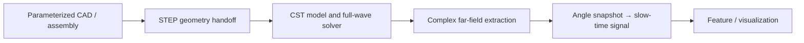
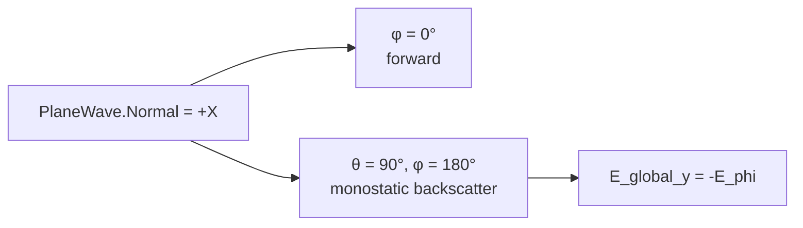

# EM-Trace — Electromagnetic Simulation and Target-Feature Analysis Toolchain

**Research Profile role:** computational electromagnetics + CST engineering workflow + data linkage + scientific debugging.

EM-Trace is a simulation-based project for building a rotor-target electromagnetic workflow and testing whether the resulting data can support downstream signal generation. The project is presented as an auditable engineering chain, with its numerical and physical limits stated explicitly.

## Problem

A rotor target is not represented by one scalar RCS value when the goal is to study motion-related signatures. The workflow must preserve geometry, incidence direction, complex amplitude and phase, polarization conventions, metadata, and time-series processing all the way from CAD to a feature representation. EM-Trace therefore treats the simulation output as a traceable data product rather than a standalone screenshot or a single “good-looking” curve.

## Engineering Pipeline

**CAD → CST → EM simulation → complex-field extraction → signal chain → feature / visualization**

## What I Built

- A parameterized SolidWorks quadrotor assembly and a controlled STEP-to-CST geometry handoff.
- A CST workflow for frequency-domain full-wave solving, adaptive-pass bookkeeping, far-field export, and solver/result metadata capture.
- A direction-aware complex-field extraction method, including the monostatic backscatter convention and the polarization-basis conversion needed for the global (y)-component.
- A Python processing chain that maps angle snapshots to a slow-time signal and downstream feature/STFT visualizations.
- An evidence workflow covering mesh sensitivity, calculation-domain sensitivity, artifact mapping, and Git-based provenance.

## Scientific Debugging

The most important output of the project is not a single number; it is the correction of assumptions that could otherwise make the number look more authoritative than it is.

| Finding | Correction | Current status |
| --- | --- | --- |
| The φ=0° sample was once labelled “backscatter”. With the saved (+X) incidence, it is the forward direction. | The extraction contract was audited and the correct monostatic observation was fixed at (θ=90°,φ=180°). | Old φ=0° files are `INVALID_DIRECTION` / `SUPERSEDED`; corrected backward extraction is documented. |
| CST spherical components were easy to confuse with global Cartesian components. | At the corrected direction, (E_{\mathrm{global},y}=-E_\phi) for this polarization basis. | Direction and basis semantics are verified in the A1 correction chain. |
| More adaptive passes did not establish a stable numerical value. | L7→L10→L13→L16 was audited without changing the registered gates. | Solver runs succeeded, but single-pose numerical convergence was not demonstrated; values remain engineering baselines. |
| Different structural models used materially different automatic calculation domains. | A3 compared automatic and unified full-reference domains instead of attributing differences to a single physical cause. | Heterogeneous-domain quantitative ablation was withdrawn; unified-domain rows remain engineering baseline comparisons. |
| The full correct-backscatter micro-motion STFT chain was not shown to be stably usable. | Stage 7 was narrowed to an angle-snapshot-driven signal-generation workflow demonstration. | No claim of quantitative micro-Doppler validation or independent blade-frequency validation is made. |

### Direction contract

## What Is Validated

- The parameterized CAD/assembly and STEP-to-CST geometry workflow.
- A CST full-wave workflow with far-field and complex-field extraction metadata.
- The corrected single-station direction contract and polarization-basis conversion.
- The software path from angle snapshots to slow-time samples and feature/STFT visualization as a processing implementation.
- A reproducible method for mesh/domain sensitivity review and artifact/provenance auditing.

These statements mean that the workflow and its checks are evidenced. They do **not** mean that every extracted field value is numerically converged.

## What Is Not Claimed

- A complete, stable, quantitatively validated correct-backscatter micro-motion chain.
- High-precision absolute RCS, proven mesh convergence, or exact quantitative structural-scattering contributions.
- Independent CST validation of a quantitative micro-Doppler spectrum.
- Real radar measurements, flight tests, or external-field generalization.

## Selected Assets

*Parameterized assembly used as the geometry starting point; this image is a model/workflow illustration, not a measurement result.*

*Processing-chain illustration. The correct-backscatter quantitative micro-motion chain remains outside the validated claim set.*

## Evidence

The compact evidence index is in [`evidence/engineering_audit.md`](evidence/engineering_audit.md). It points to the frozen source reports and commits in the public [EM-Trace repository](https://github.com/feiranzhao15077/EM-Trace).

No CST project files, caches, raw solver logs, tokens, or machine-local paths are included in this profile repository.
