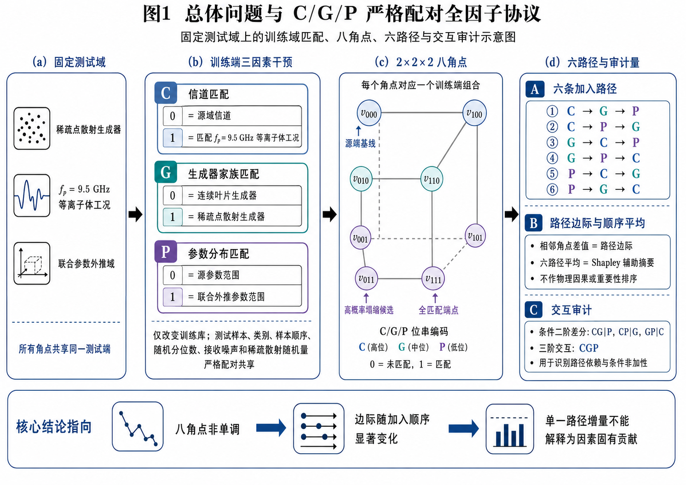
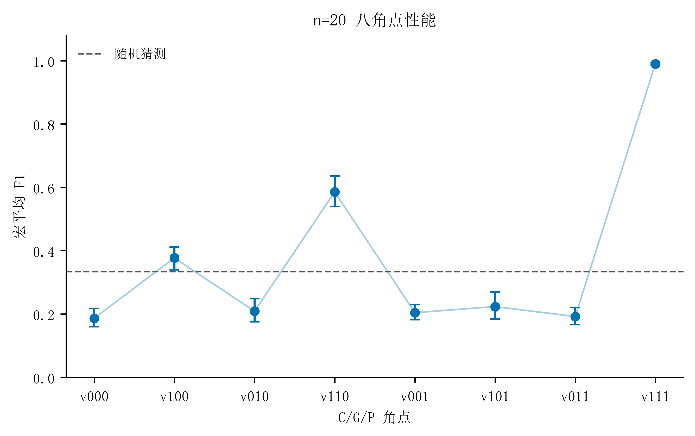
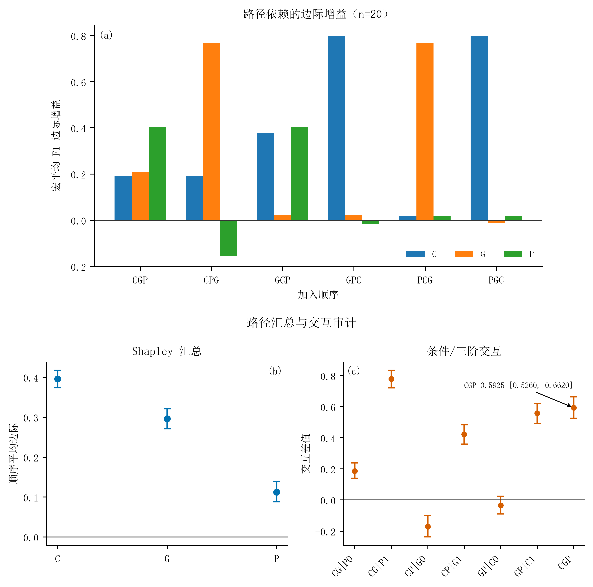
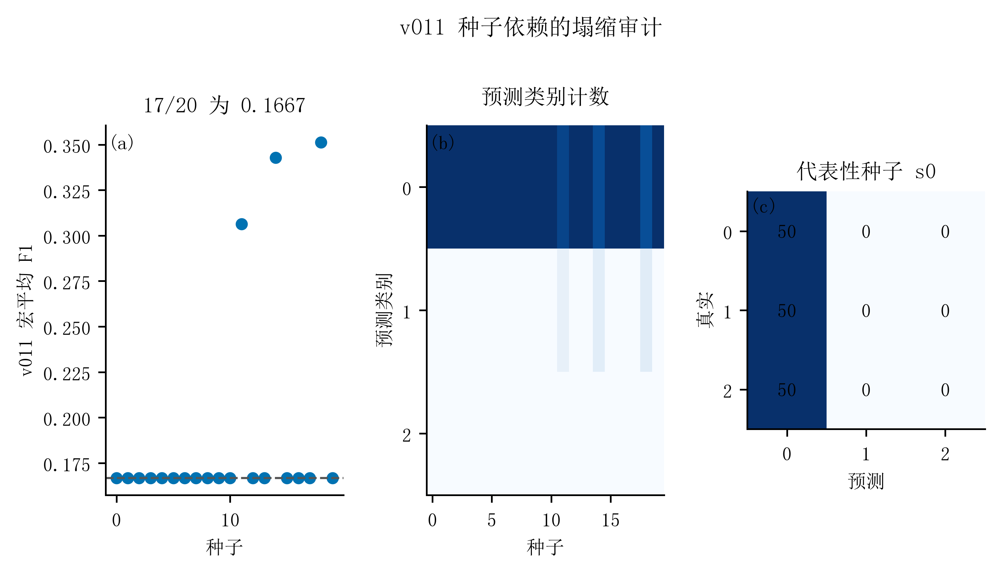

# EMvision

> **一句话定位：** 在等离子体衰减作为受控信道失配的合成旋翼微多普勒任务中，构建物理信号链，并用严格配对的 C/G/P 全因子协议评估域匹配、路径依赖与交互。

## Research Question

EMvision 研究一个固定测试域上的训练域失配问题：当训练端的信道匹配（C）、生成器家族匹配（G）和参数分布匹配（P）分别打开或关闭时，识别性能如何变化？这些边际是否依赖加入顺序，三因素之间是否存在条件交互和非加性，异常角点是否可能由种子波动或实现问题解释？

这是一个**合成仿真审计**，不是实测雷达性能上限或真实等离子体传播结论。

## What I Built

- 建立解析等离子体衰减—旋翼微多普勒信号链，保留连续叶片积分与稀疏点散射两类生成器，用于受控的生成器匹配比较。
- 实现七维微多普勒特征、训练集拟合的标准化流程和 MLP 三分类识别评估。
- 设计严格配对的 C/G/P `2×2×2` 八角点协议：所有角点共享固定测试域，在 20 个外层种子上比较训练端干预。
- 将六条因素加入路径、Shapley 顺序平均、条件二阶交互和三阶交互统一落盘并配套 bootstrap 审计。
- 对负对照和 `v011` 角点执行逐种子 Macro-F1、预测计数、logits 与特征分布检查，保留异常和负结果。

## Method

```text
解析传播/等离子体衰减模型
        ↓
合成旋翼微多普勒回波
        ↓
固定联合外推测试域
        ↓
C/G/P 训练域全因子干预
        ↓
七维特征 + MLP 分类器
        ↓
Macro-F1、路径边际、Shapley 与交互审计
```

主协议使用 `fp=9.5 GHz` 等离子体工况、`f0=10 GHz` 载频、每类 200 个训练样本和每类 50 个测试样本；主全因子结果使用 20 个种子及 50,000 次配对种子块 bootstrap。

## Key Results

1. 在固定的稀疏生成器、`fp=9.5 GHz` 联合外推测试域上，`v000 → v111` 的 Macro-F1 均值由 **0.1864** 升至 **0.9897**；端点增益 **0.8033**，配对 bootstrap 95% CI 为 **[0.7729, 0.8299]**。这说明在该协议下，训练域匹配组合会显著改变固定测试域表现。
2. 条件路径边际会改变符号：`CP|G=0` 为 **−0.1713**（95% CI **[−0.2379, −0.1007]**），而 `CP|G=1` 为 **0.4212**（95% CI **[0.3587, 0.4828]**）。这支持条件交互和路径依赖的判断。
3. 三阶交互 `CGP` 为 **0.5925**，配对 bootstrap 95% CI 为 **[0.5260, 0.6620]**，表明八角点变化不能由三个单因素边际简单相加解释。
4. `v011` 角点在 **17/20** 个种子上出现 Macro-F1 **0.1667** 的单类塌缩，另外 3 个种子部分恢复到 **0.3063–0.3513**；因此证据支持“高概率且种子依赖的塌缩候选”，不支持普遍确定性机制。
5. 辅助负对照中，噪声-only Macro-F1 为 **0.324±0.022**，乱序标签为 **0.319±0.084**（各 6 次运行），接近三分类 chance **0.3333**；这用于检查流程是否产生明显的无信息高分。

## What This Project Shows

- 将电磁传播假设转化为可检查的合成信号和特征链；
- 设计配对、固定测试域和联合参数外推的数值实验；
- 使用机器学习分类器完成受控验证，而不是把分类器本身包装成创新；
- 对路径、交互、种子波动和负对照进行可复核的统计整理；
- 在发现异常后保留逐种子证据并降级解释范围，体现科研软件工程与科学调试能力。

## Limitations

- 项目目前是纯仿真研究，没有真实雷达回波、实测介质参数或外场验证；
- 等离子体层在这里是受控的解析信道失配场景，结论不能直接外推为一般等离子体物理适用范围；
- 主分析固定为七维特征和单一 MLP，Shapley 只是对冻结性能表六条路径的压缩摘要，不是模型无关的因果推断；
- bootstrap 只描述种子层面的不确定性，不涵盖物理模型误差。FDTD、PO、CST 等支线不构成本文的端到端独立全波或实测验证。

## Selected Evidence

### 1. Protocol map



固定测试域、C/G/P 三因素、八角点、六条路径与交互审计的总览图。

### 2. n=20 corner performance



八个训练域角点在固定测试域上的 Macro-F1 均值和不确定性。

### 3. Path and interaction audit



六条加入路径、Shapley 顺序平均以及条件/三阶交互的联合展示。

### 4. v011 collapse audit



`v011` 的逐种子 Macro-F1、预测类别计数和代表性混淆矩阵。

## Repository / Evidence

- [EMvision 原始仓库](https://github.com/feiranzhao15077/EMvision)：完整源码、实验协议和验证记录。
- [n=20 全因子结果](https://github.com/feiranzhao15077/EMvision/blob/master/outputs/em-sense/data/factorial_attribution_n20/results.json)：八角点、六路径、Shapley、交互和 bootstrap 结果。
- [v011 逐种子审计](https://github.com/feiranzhao15077/EMvision/blob/master/outputs/em-sense/docs/validation/v011_n20_logits_features.md)：logits、预测计数和特征分布审计。
- [证据索引](evidence/key_results.md)：本展示页中每条结论与原始证据的对应关系。

本目录只保留项目展示所需的精选图和证据索引，不包含完整源码、原始数据、缓存或本地工作路径。
