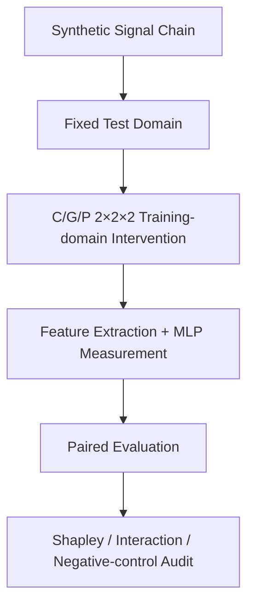

# EMvision

在固定合成测试域上，通过 C/G/P 全因子与严格配对协议，分析旋翼微多普勒识别中的域失配、路径依赖和协议内统计归因。

---

## Project Overview

| Field | Content |
| ----- | ------- |
| Project Type | Controlled Synthetic Experiment Framework |
| Status | Completed showcase / frozen synthetic factorial study |
| Role | Synthetic signal-chain implementation, C/G/P factorial protocol design, paired evaluation, statistical attribution, and negative-control audit |
| Keywords | Rotor Micro-Doppler, Domain Mismatch, Full Factorial Design, Paired Evaluation, Shapley Attribution, Interaction Analysis, Negative Controls, Reproducibility |

EMvision 研究固定测试域上的训练域失配问题：当训练端的信道匹配（C）、生成器家族匹配（G）和参数分布匹配（P）分别打开或关闭时，识别性能如何变化；这些边际是否依赖因素加入顺序，以及三因素之间是否存在条件交互和非加性。

所有 factorial corners 共享同一固定合成测试域，仅改变训练端的 C/G/P 配置。当前验证范围限定为解析信号链、synthetic simulation、冻结的 `2×2×2` 全因子协议、配对种子评估和协议内统计审计；不包含真实雷达数据、真实等离子体环境验证或泛化性能保证。

## Problem and Motivation

只比较完全失配的 `v000` 与完全匹配的 `v111`，只能观察端点差异，不能区分变化来自信道匹配、生成器家族匹配还是参数分布匹配，也不能判断不同因素是否具有路径依赖或非加性交互。

因此，本项目将 C/G/P 作为三个二元训练域因素，构建八个 factorial corners，并在固定测试域和相同外层种子下进行 paired evaluation。Full factorial design 用于检查条件二阶交互和三阶交互；六条因素加入路径及 Shapley 顺序平均用于压缩路径信息；noise-only、shuffled-label 和异常角点审计用于检查实验流程是否产生无信息高分或种子依赖失效。

MLP 在项目中是冻结协议下的 measurement instrument，不是新分类算法。该实验框架用于分析受控合成域失配，不解决真实复杂电磁环境中的识别问题。

## Architecture / Method

- **Eight factorial corners**：使用 `v000`–`v111` 位串编码 C/G/P 的未匹配与匹配状态，所有角点共享同一测试样本、类别、样本顺序、随机分位数、接收噪声和稀疏散射随机量。
- **Synthetic signal chain**：解析传播与等离子体衰减模型连接连续叶片积分和稀疏点散射两类旋翼微多普勒生成器。
- **Feature and measurement**：提取七维微多普勒特征，使用仅由训练集拟合的标准化流程和 MLP 三分类器测量固定测试域表现。
- **Paired evaluation**：主结果使用 20 个外层种子，以及 50,000 次 paired seed-block bootstrap 评估种子层面的不确定性。
- **Path and interaction audit**：计算六条 C/G/P 加入路径、Shapley 顺序平均、条件二阶交互和三阶交互。
- **Seed-level audit**：对 `v011` 执行逐种子 Macro-F1、预测类别计数、logits 与特征分布检查，并结合 negative controls 判断异常是否可能来自流程或随机性。

主协议使用 `fp=9.5 GHz` 等离子体工况、`f0=10 GHz` 载频、每类 200 个训练样本和每类 50 个测试样本。上述配置用于冻结合成协议，不代表真实设备或外场参数。

## My Contribution

- **解析旋翼微多普勒合成信号链实现**：将解析传播与受控衰减模型连接到复回波、特征和识别测量流程。
- **连续叶片与稀疏点散射生成器设计**：保留两类生成器，用于受控的 generator-family matching 比较。
- **C/G/P full factorial protocol**：构建信道、生成器家族和参数分布三因素的 `2×2×2` 八角点实验。
- **Fixed test domain 实验设计**：固定测试样本和随机量，只改变训练端干预，减少测试域变化对比较的混入。
- **Paired evaluation 和 bootstrap**：组织 20 个配对外层种子及 50,000 次 seed-block bootstrap。
- **Shapley 路径汇总与交互分析**：整理六条因素加入路径、顺序平均、条件二阶交互和三阶交互。
- **Negative controls**：实现 noise-only 与 shuffled-label controls，检查无信息输入是否产生异常高分。
- **v011 collapse audit**：保存逐种子性能、预测计数、logits、特征分布和代表性混淆矩阵。
- **Provenance 和冻结结果整理**：将角点、路径、交互、bootstrap、异常审计和证据映射到冻结结果文件。

## Representative Results

### 1. v000–v111 Endpoint Difference

在固定的稀疏生成器、`fp=9.5 GHz` 联合外推测试域上，`v000 → v111` 的 Macro-F1 均值由 `0.1864` 变为 `0.9897`。端点差值为 `0.8033`，paired bootstrap 95% CI 为 `[0.7729, 0.8299]`，说明训练域匹配组合在当前冻结协议下显著影响固定测试域表现。

**Boundary：**该结果仅适用于当前 synthetic signal chain、固定测试域、特征和 MLP 测量协议，不代表真实雷达数据上的泛化性能保证。

### 2. Path-dependent Attribution and Interaction

六条因素加入路径表现出不同的边际变化。条件交互 `CP|G=0` 为 `−0.1713`，95% CI 为 `[−0.2379, −0.1007]`；`CP|G=1` 为 `0.4212`，95% CI 为 `[0.3587, 0.4828]`。三阶交互 `CGP` 为 `0.5925`，paired bootstrap 95% CI 为 `[0.5260, 0.6620]`，表明当前八角点变化不能由三个单因素边际简单相加解释。

**Boundary：**Shapley 仅是冻结性能表上六条加入路径的顺序平均摘要，条件与三阶交互也只描述当前 full factorial protocol；它们不是物理因果贡献或协议外的重要性排序。

### 3. v011 Collapse and Negative Controls

`v011` 在 17/20 个种子上出现 Macro-F1 `0.1667` 的单类塌缩，另外 3 个种子部分恢复至 `0.3063–0.3513`。辅助负对照中，noise-only Macro-F1 为 `0.324±0.022`，shuffled-label 为 `0.319±0.084`（各 6 次运行），接近三分类 chance `0.3333`。

**Boundary：**这些结果用于标记当前协议中的种子依赖异常角点并检查实验流程是否产生明显的无信息高分；它们不证明普遍确定性 collapse mechanism，也不代表真实系统故障规律。

## Figures / Evidence

### 1. C/G/P protocol map

*固定测试域、C/G/P 三因素、八个 factorial corners、六条加入路径与交互审计的总览图。*

- **支持的结论**：展示受控训练域干预、严格配对、路径汇总和交互分析之间的协议关系。
- **不支持的结论**：不证明 C/G/P 是真实环境中的完整因素集合，也不构成物理因果图。

### 2. Corner performance

*20 个配对种子下，八个训练域角点在固定测试域上的 Macro-F1 均值与不确定性。*

- **支持的结论**：当前冻结协议中的角点表现非单调，`v000` 与 `v111` 之间存在明确端点差异。
- **不支持的结论**：不表示任意真实域失配都产生相同排序，也不提供真实雷达泛化性能。

### 3. Path and interaction audit

*六条加入路径、Shapley 顺序平均以及条件与三阶交互的联合展示。*

- **支持的结论**：当前 full factorial performance table 存在路径依赖、条件交互和非加性。
- **不支持的结论**：Shapley 汇总不是模型无关的因果归因，交互量也不能外推为一般物理贡献。

`v011` 的逐种子 collapse 证据保留在 [seed-level audit](https://github.com/feiranzhao15077/EMvision/blob/master/outputs/em-sense/docs/validation/v011_n20_logits_features.md) 和 [`evidence/key_results.md`](evidence/key_results.md) 中，本展示页未重新运行实验。

## Limitations

- Synthetic simulation only；全部结果来自冻结的合成数据和解析信号链。
- Fixed test domain；结论限定在当前联合外推测试域及其样本构造方式。
- Controlled protocol only；C/G/P 是实验设计中的受控因素，不代表真实环境的完整变化来源。
- No measured radar data；无真实雷达回波、外场实验或硬件验证。
- No real plasma validation；等离子体衰减仅作为受控解析信道失配场景，不代表真实等离子体传播结论。
- Single feature set and MLP；主分析固定为七维特征和单一 MLP measurement instrument。
- Shapley not causal attribution beyond protocol；顺序平均不能解释为协议外物理因果贡献。
- Bootstrap does not include physical-model uncertainty；当前区间只描述种子层面的不确定性。
- FDTD、PO、CST 等支线不构成当前结论的端到端独立全波或实测验证。

## Repository / Evidence

- **Selected Implementation**: [EMvision selected code](../../selected-code/emvision/). This snapshot is provided for implementation review only and is not a complete reproduction package.
- **Original Repository**：[EMvision source repository](https://github.com/feiranzhao15077/EMvision)
- **Frozen Factorial Results**：[n=20 full-factorial results](https://github.com/feiranzhao15077/EMvision/blob/master/outputs/em-sense/data/factorial_attribution_n20/results.json)
- **v011 Seed-level Audit**：[v011 logits, prediction counts, and feature audit](https://github.com/feiranzhao15077/EMvision/blob/master/outputs/em-sense/docs/validation/v011_n20_logits_features.md)
- **Portfolio Evidence Index**：[Evidence mapping for showcase claims](evidence/key_results.md)

本目录只保留项目展示所需的精选图和证据索引，不包含完整源码、原始数据、缓存或本地工作路径。
