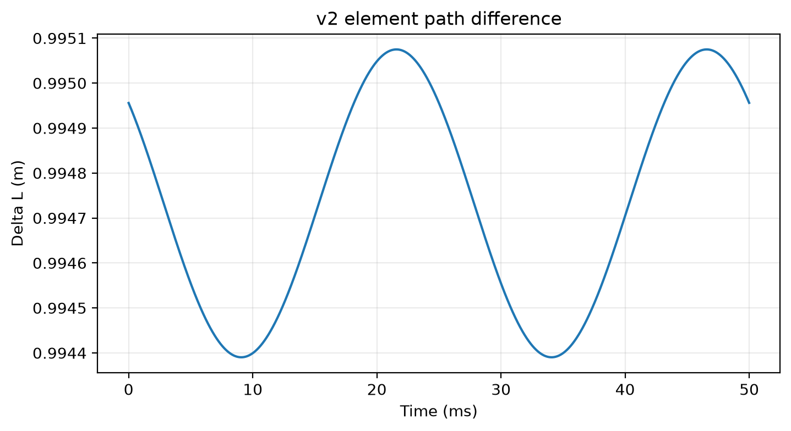

# LowAlt-MD

低空旋翼目标微多普勒物理建模与多径机制分析

> **一句话定位：** 在平坦有耗地面和低阶镜面多径近似下，研究旋翼运动散射单元的路径相位如何改变微多普勒结构，并验证这种变化对跨环境识别可靠性的影响。

## Physical Problem

低空旋翼目标的回波同时受到旋翼周期运动、目标—地面传播路径和相干叠加的影响。项目关注的核心问题不是单纯提高分类器指标，而是建立一条可检查的物理链：

```text
散射单元运动
    ↓
直达/反射路径差
    ↓
单元相关传播相位
    ↓
相干叠加
    ↓
微多普勒结构与跨环境特征域变化
```

## Modeling Pipeline


## What I Built

- **Physics Model v2**：修正 Fresnel 镜像几何，并将固定倾斜旋翼冻结为 `p(t)=Ry(β)Rz(ωt)p0`
- **分层传播模型**：实现 M0 自由空间、M1 共同复增益、M2 逐散射单元有效两项代理和 M3 `DD/DR/RD/RR` 四路径原型
- **散射与信号生成**：使用 2/3/4 叶旋翼和各向同性点散射单元，生成复回波、频谱及时频特征
- **数值验证链**：完成 Fresnel、运动学、路径长度、相位、full-target 功率账本和 pairwise 干涉闭合验证
- **受控识别协议**：完成 Track A/Track B、paired latent、label-permutation 和 matched-budget 未见高度实验

## Validation & Debugging

项目中一个重要的科研过程是：**发现旧模型问题 → 修正物理定义 → 重新验证 → 更新结论**。

| 检查项 | 旧问题 | Physics Model v2 修正 |
| --- | --- | --- |
| Fresnel 入射角 | 反射路径角度未正确使用镜像雷达高度 | 从地面法向重新定义镜像几何入射角 |
| 倾斜旋翼运动学 | 旋转与倾斜矩阵次序不符合固定刚体旋转 | 采用 `Ry(β)Rz(ωt)p0` |
| 四路径功率 | 逐散射单元量与 full-target 量容易混用 | 先按路径聚合，再统一计算 coherent/incoherent power |
| 识别数据 | R2.1 曾存在重新渲染和组合不完整风险 | 直接复用冻结 R2 带噪特征，完成四组合置乱闭环 |
| 泛化预算 | 旧 R3 未同时控制 latent diversity 与 waveform 数量 | v2 同时匹配 unique latent-state budget 和 waveform budget |

当前验证状态：

- `F6 / M0 / M1 = PASS`
- `M2 / M2.5 = PASS`
- `M3-alpha / beta = PASS`
- `R2 / R2.1 / R3 = PASS`（R3 的 PASS 表示协议和实验完成，不表示多环境优势成立）

## Key Findings

1. 对非零、时不变、cell-common、无噪声复增益，归一化微多普勒结构保持不变。
2. 逐散射单元的非共同复权重可以改变归一化微多普勒结构。
3. 当前参数下，几何路径相位异质性明显强于 Fresnel 单元间变化。
4. M3 full-target 功率账本在 200 m 与 400 m 呈现不同的相消/相长倾向。
5. Track A 含有明显的合成类别能量 shortcut；Track B 能量控制后仍保留结构可分性。

## Negative Result

在同时匹配 unique latent-state budget 与 waveform budget 的条件下，20 m+40 m 简单多环境联合训练在未见 80 m 环境上未稳定优于最佳单环境基线，部分模型/距离条件下存在性能代价。

这一结果只说明：在当前物理模型、结构特征、简单分类器和 20/40→80 m 协议下，增加两个已见高度并没有自动形成稳定的未见高度表示；它不等价于“多环境训练普遍无效”。

## Limitations

- 合成仿真、平坦有耗镜面地面、10 GHz 和远场主工况
- 各向同性点散射代理，不含标定叶片 RCS、路径相关双站散射、天线方向图或实测雷达验证
- 四路径是低阶可解释传播近似；Track B 是能量控制协议，不代表已经消除所有 shortcut

## Selected Visual Evidence


*M1 共同复增益与 M2 逐单元有效两项代理的归一化谱对照。*



*运动散射单元路径差随时间变化。*


*200 m 与 400 m 的 full-target coherent/incoherent power 对照。*


*受控结构特征的同环境与跨环境识别结果。*

R3 的未见高度结果保留在 [`evidence/validation_summary.md`](evidence/validation_summary.md) 及原始仓库的冻结 CSV 中，未为展示重新运行实验。

## Original Repository

完整源码、实验脚本、Physics v2 验证报告和 v2 结果位于：[LowAlt-MD 原始仓库](https://github.com/feiranzhao15077/LowAlt-MD)。

当前科学口径以 [Physics v2 scientific status freeze](https://github.com/feiranzhao15077/LowAlt-MD/blob/master/docs/final/LowAlt-MD_physics_v2_scientific_status_freeze_v1.md) 为准；本展示目录只保留摘要和精选证据，不包含完整数据集、临时日志或本地路径。
