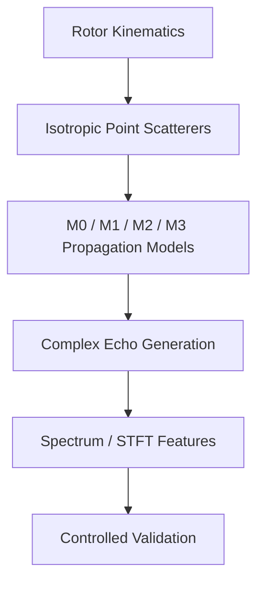
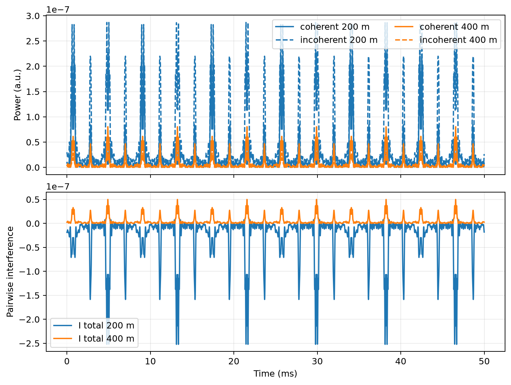
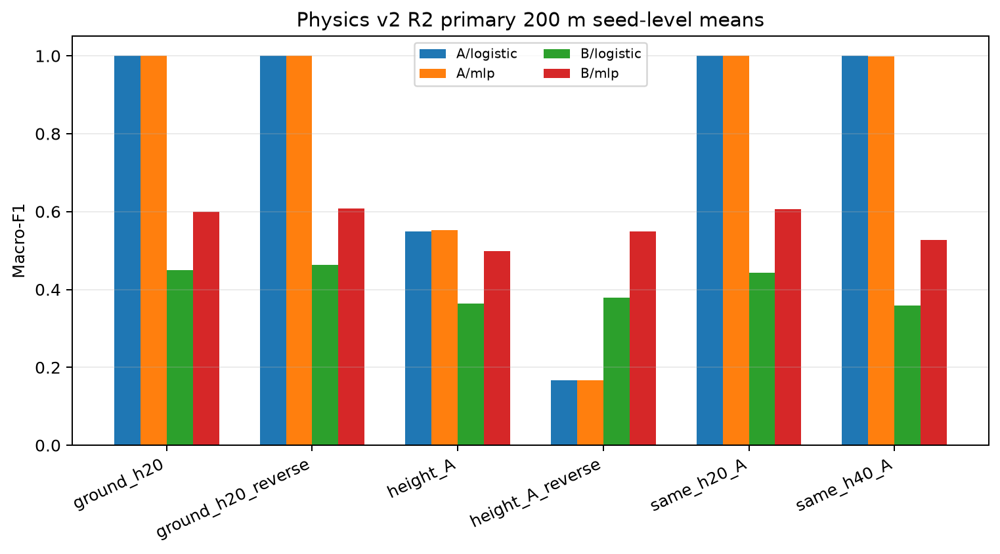

# LowAlt-MD

在合成平坦地面多径模型下，研究旋翼散射单元的路径相位与相干叠加如何改变微多普勒结构，并通过受控实验分析跨环境识别边界。

---

## Project Overview

| Field | Content |
| ----- | ------- |
| Project Type | Low-altitude Rotor Micro-Doppler Mechanism Study |
| Status | Completed showcase / Synthetic Physics Model v2 validation complete |
| Role | Rotor-motion and multipath modeling, complex echo generation, validation protocol design, and mechanism analysis |
| Keywords | Computational Electromagnetics, Rotor Kinematics, Ground Multipath, Coherent Interference, Micro-Doppler, Fresnel Reflection, Synthetic Experiments, Mechanism Analysis |

本项目以低空旋翼目标为研究对象，在 synthetic low-altitude propagation model 中分析旋翼周期运动、地面反射路径与相干叠加对微多普勒结构的影响。核心问题不是单纯提高分类器指标，而是区分公共传播增益、散射单元相关复权重、路径相位异质性和四路径干涉分别支持哪些机制解释。

当前验证范围包括 Physics Model v2 的运动学与镜像传播几何、M0–M3 分层传播模型、复回波与频谱/STFT 特征生成、数值闭合检查，以及受控的同环境与跨环境识别协议。全部结果来自合成数据，不构成真实低空环境或实测雷达验证。

## Problem and Motivation

旋翼周期运动使不同散射单元产生随时间变化的径向速度和传播路径，从而形成微多普勒。当地面反射被引入后，其作用不能在所有条件下简单等价为统一幅度衰减：不同散射单元可能具有不同的路径差、传播相位和复权重，相干叠加后可能改变归一化频谱及时频结构。

为了避免把数值变化直接解释为物理规律，本项目采用 M0–M3 分层模型逐步增加机制复杂度：先建立自由空间基线，再检查公共复增益、散射单元相关复权重和显式四路径干涉。该设计用于定位结构变化来自哪一层假设，并为后续识别实验提供可审计的证据边界，而不是揭示真实低空环境中的一般电磁规律。

## Architecture / Method

- **Rotor Kinematics**：Physics Model v2 使用 `p(t)=Ry(β)Rz(ωt)p0` 表达固定倾角旋翼，并检查旋翼法向与刚体距离约束。
- **Fresnel Reflection and Image Geometry**：使用镜像雷达几何重新定义地面入射角，使反射系数、路径长度和传播相位采用一致的几何语义。
- **Layered Propagation Models**：M0 为自由空间基线；M1 引入公共复增益；M2/M2.5 引入散射单元相关复权重与 path phase diversity；M3 显式组织 `DD/DR/RD/RR` paths。
- **Coherent Aggregation**：先按路径聚合各散射单元复场，再计算 full-target coherent/incoherent power，避免混用逐单元量和整目标量。
- **Numerical Validation**：使用 power ledger、pairwise interference closure、路径长度与相位检查验证数值账本；验证通过表示实现与协议闭合，不表示真实环境模型已得到验证。

## My Contribution

- **Physics Model v2 实现**：修正旋翼运动学、Fresnel 入射角和镜像传播几何。
- **M0–M3 分层传播模型构建**：实现自由空间、公共复增益、散射单元相关有效两项模型和 `DD/DR/RD/RR` 四路径原型。
- **复回波与特征流程**：使用 2/3/4 叶旋翼和 isotropic point scatterer proxy，生成复回波、频谱和 STFT 特征。
- **数值验证链**：完成 path phase、full-target power ledger 和 pairwise interference closure 检查。
- **受控实验协议**：设计 paired latent、label permutation、matched latent diversity 和 matched waveform budget 实验。
- **证据边界整理**：记录被修正的模型问题、negative result、适用范围及被 Physics Model v2 取代的旧结论。

## Representative Results

### 1. Common Gain vs. Element-dependent Weighting

在 M1 中，在无噪声条件下，非零、时不变且散射单元共享的公共复增益不会改变归一化结构，对应 normalized-spectrum L2 为 `4.2423×10^-17`。在 M2 中，散射单元相关的非公共复权重可以改变归一化微多普勒结构，对应 L2 为 `0.025246`。

**Boundary：**该结果仅支持当前模型下公共复增益与散射单元相关复权重的机制区分，不证明真实地面反射一定产生相同幅度的结构变化。

### 2. Path Phase and Coherent Interference

在当前主配置中，M2.5 的 path-phase spatial standard deviation 为 `0.776588 rad`，同一工况下 Fresnel-phase spatial standard deviation 为 `3.23×10^-7 rad`。M3 的 coherent/incoherent ratio 在 200 m 和 400 m 分别为 `0.4311` 与 `2.4181`，pairwise interference 呈现不同的相消与相长倾向；对应 power-ledger closure residual 分别为 `1.3235×10^-22` 和 `5.9557×10^-23`。

**Boundary：**这些结果依赖当前合成参数、平坦有耗地面和低阶镜面多径假设，只说明当前配置中的 path phase diversity 与相干干涉行为。

### 3. Matched-budget Negative Result

在同时匹配 unique latent-state budget 与 waveform budget 后，20 m + 40 m 多环境训练没有在未见的 80 m 条件下稳定超过最佳单环境基线。multi − best-single 的配对差值在 200 m 为 `−0.0322`（Logistic Regression）和 `−0.0434`（MLP），在 400 m 为 `−0.0158` 和 `−0.0222`。

**Boundary：**该 negative result 仅适用于当前 Physics Model v2、结构特征、简单分类器和固定 `20/40→80 m` 协议，不代表所有模型、特征或真实数据中的多环境训练均无效。

## Figures / Evidence

### 1. M3 coherent and incoherent power

*M3 在 200 m 与 400 m 条件下的 full-target coherent/incoherent power 和 pairwise interference。*

- **支持的结论**：当前合成配置在两个距离条件下呈现不同的相消与相长倾向，且干涉项可通过 power ledger 审计。
- **不支持的结论**：不证明真实地面环境在相同距离下具有相同干涉规律，也不构成实测雷达验证。

### 2. M1 and M2 normalized spectrum

*M1 公共复增益与 M2 散射单元相关复权重的归一化频谱对照。*

- **支持的结论**：当前模型中，公共复增益保持归一化结构，而散射单元相关复权重可以改变该结构。
- **不支持的结论**：不提供真实叶片 RCS、真实地面传播或定量实测微多普勒的一致性证明。

### 3. Controlled recognition experiment

*Track B 在同环境与跨环境条件下的受控结构特征识别结果。*

- **支持的结论**：经过 scatterer-strength control 和 waveform RMS normalization 后，选定设置中仍存在高于机会水平的结构信息，同时结果对环境条件敏感。
- **不支持的结论**：不证明所有 shortcut 或 leakage 风险已消除，也不代表真实雷达数据上的识别性能或泛化能力。

R3 未见高度结果及完整数值表保留在 [`evidence/validation_summary.md`](evidence/validation_summary.md) 和原始仓库的冻结结果中，本展示页未重新运行实验。

## Limitations

- 仅使用 synthetic data，全部结论限定在数值仿真范围内。
- 假设 flat lossy ground，不包含真实地形标定；Ground A/B 仅为 `illustrative_control`，不是实测地面类别。
- 使用 low-order specular multipath approximation，不包含 rough surface scattering 或 diffuse scattering。
- 旋翼叶片采用 isotropic point scatterer proxy，不包含 calibrated blade RCS 或路径相关双站散射模型。
- 无 measured radar data、实测天线方向图或真实雷达闭环验证。
- 无 full-wave target-background simulation；M3 四路径模型是低阶、可解释的传播近似。
- 当前结果不外推为真实低空环境中的一般传播、识别或泛化规律。

## Repository / Evidence

- **Original Repository**：[LowAlt-MD source repository](https://github.com/feiranzhao15077/LowAlt-MD)
- **Validation Summary**：[Portfolio validation summary](evidence/validation_summary.md)
- **Scientific Status Freeze**：[Physics Model v2 scientific status freeze](https://github.com/feiranzhao15077/LowAlt-MD/blob/master/docs/final/LowAlt-MD_physics_v2_scientific_status_freeze_v1.md)
- **Frozen Result Tables**：[Quantitative evidence and frozen result locations](evidence/validation_summary.md#quantitative-evidence)
